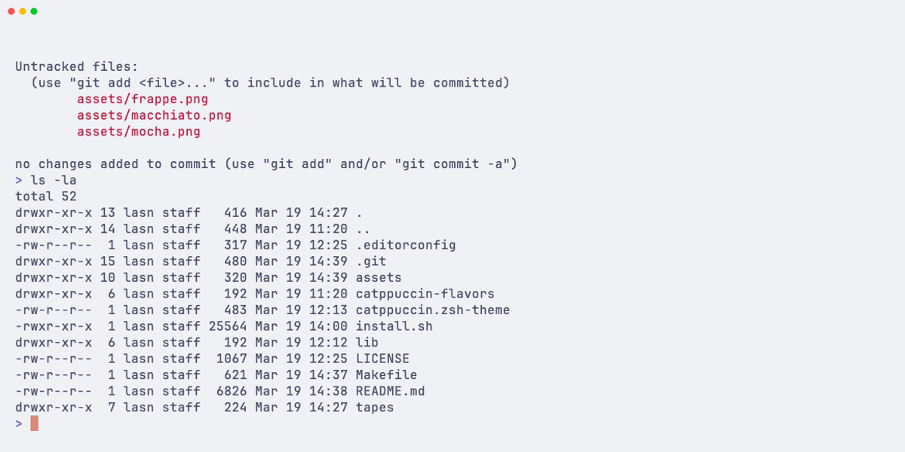
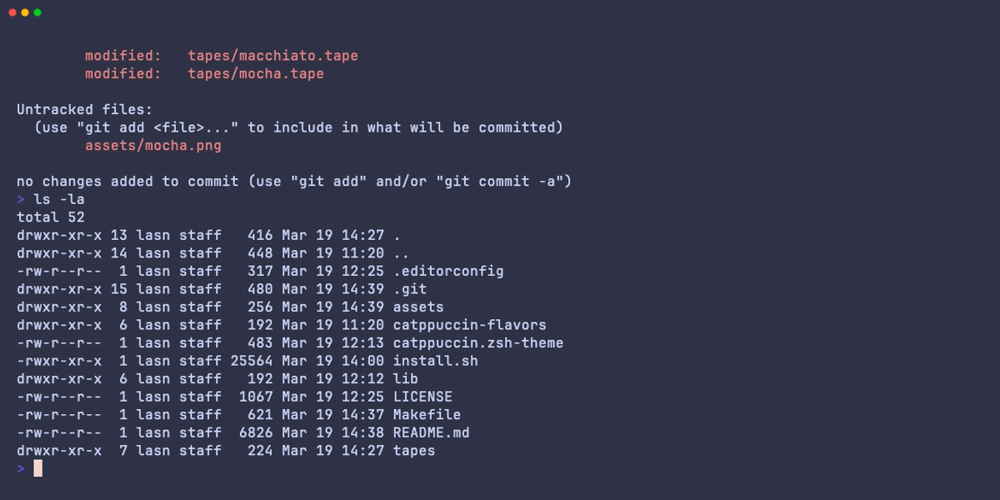
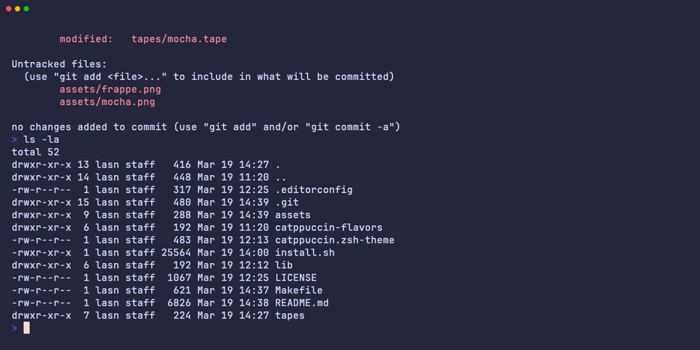
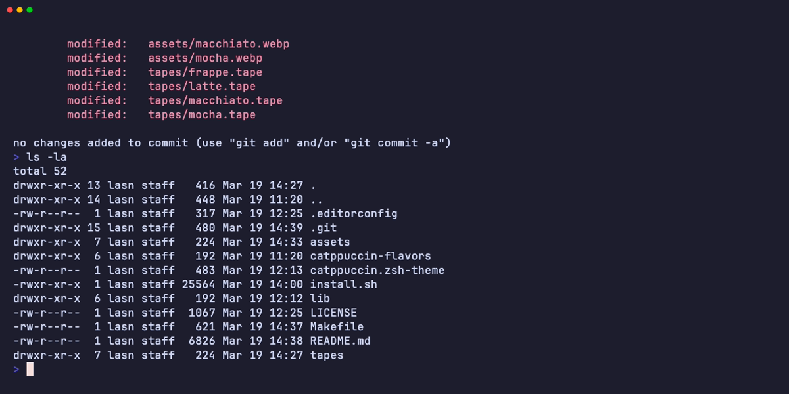

<h3 align="center">
  <br/>
  
  Catppuccin for <a href="https://ohmyz.sh/">Oh My Zsh</a>
  
</h3>

<p align="center">
  <a href="https://github.com/Xerrion/catppuccin-oh-my-zsh/stargazers"></a>
  <a href="https://github.com/Xerrion/catppuccin-oh-my-zsh/issues"></a>
  <a href="https://github.com/Xerrion/catppuccin-oh-my-zsh/contributors"></a>
</p>

<p align="center">
  
</p>

## Previews

<details>
<summary>Latte</summary>

</details>
<details>
<summary>Frappe</summary>

</details>
<details>
<summary>Macchiato</summary>

</details>
<details>
<summary>Mocha</summary>

</details>

## Prerequisites

- [Oh My Zsh](https://ohmyz.sh/) installed
- A [Nerd Font](https://www.nerdfonts.com/) installed and configured in your terminal (required for segment icons and powerline glyphs)

## Installation

### Quick Install (Recommended)

```bash
zsh -c "$(curl -fsSL https://raw.githubusercontent.com/Xerrion/catppuccin-oh-my-zsh/main/install.sh)"
```

1. Clone the repository:

```bash
git clone https://github.com/Xerrion/catppuccin-oh-my-zsh.git "${ZSH_CUSTOM:-$HOME/.oh-my-zsh/custom}/themes/catppuccin-oh-my-zsh"
```

2. Symlink the theme:

```bash
ln -sf "${ZSH_CUSTOM:-$HOME/.oh-my-zsh/custom}/themes/catppuccin-oh-my-zsh/catppuccin.zsh-theme" "${ZSH_CUSTOM:-$HOME/.oh-my-zsh/custom}/themes/catppuccin.zsh-theme"
```

3. Set the theme in your `~/.zshrc`:

```bash
ZSH_THEME="catppuccin"
```

### Plugin Managers

<details>
<summary>zinit</summary>

```bash
zinit light Xerrion/catppuccin-oh-my-zsh
```
</details>

<details>
<summary>antigen</summary>

```bash
antigen theme Xerrion/catppuccin-oh-my-zsh catppuccin
```
</details>

<details>
<summary>zplug</summary>

```bash
zplug "Xerrion/catppuccin-oh-my-zsh", as:theme
```
</details>

<details>
<summary>sheldon</summary>

Add to `~/.config/sheldon/plugins.toml`:

```toml
[plugins.catppuccin]
github = "Xerrion/catppuccin-oh-my-zsh"
```
</details>

## Quick Start with Presets

The fastest way to get a great-looking prompt is with a preset. Add this to your `~/.zshrc` **before** `source $ZSH/oh-my-zsh.sh`:

```bash
CATPPUCCIN_PRESET="powerline"  # Options: minimal, classic, powerline, rainbow, p10k
```

### Available Presets

| Preset | Style | Layout | Description |
|--------|-------|--------|-------------|
| `minimal` | plain | oneline | Clean and distraction-free. Just arrow, directory, and git. |
| `classic` | plain | twoline | Traditional prompt with user, host, directory, git. Time on the right. Dot separators. |
| `powerline` | powerline | twoline | Colored background segments with powerline arrows. OS icon, dir, git left. Status, languages, time right. Transient prompt. |
| `rainbow` | rainbow | twoline | Every segment has a unique vibrant background. Maximum visual flair. All segments enabled. |
| `p10k` | powerline | twoline | Closest match to a Powerlevel10k rainbow setup. OS icon + dir + git left, status + exec time + languages + time right. Transient prompt. |

Presets set sensible defaults but any setting can still be overridden individually:

```bash
CATPPUCCIN_PRESET="powerline"
CATPPUCCIN_SHOW_USER="true"          # Override: show username even though powerline preset hides it
CATPPUCCIN_TRANSIENT_PROMPT="false"  # Override: disable transient prompt
```

## Configuration

Add these to your `~/.zshrc` **before** `source $ZSH/oh-my-zsh.sh`:

### Flavor

```bash
CATPPUCCIN_FLAVOR="mocha"  # Options: mocha (default), frappe, macchiato, latte
```

### Layout

```bash
CATPPUCCIN_LAYOUT="twoline"  # Options: oneline, twoline (default)
```

### Style

```bash
CATPPUCCIN_STYLE="plain"  # Options: plain (default), powerline, rainbow
```

| Style | Description |
|-------|-------------|
| `plain` | Text-only segments joined by a configurable separator |
| `powerline` | Segments with colored backgrounds and powerline arrow transitions |
| `rainbow` | Like powerline, but each segment gets a unique accent background |

### Separator (plain style)

```bash
CATPPUCCIN_SEPARATOR="space"  # Options: space (default), arrow, bar, dot, powerline, chevron, round, slash, or any custom string
```

### Segments

All segments can be individually toggled:

| Variable | Default | Description |
|----------|---------|-------------|
| `CATPPUCCIN_SHOW_OS_ICON` | `false` | OS-specific Nerd Font icon (auto-detected) |
| `CATPPUCCIN_SHOW_ARROW` | `true` | Status indicator arrow (green/red) |
| `CATPPUCCIN_SHOW_STATUS` | `false` | Exit code / status icon |
| `CATPPUCCIN_SHOW_PROMPT_CHAR` | `true` | Prompt character on line 2 (twoline mode) |
| `CATPPUCCIN_SHOW_USER` | `true` | Username |
| `CATPPUCCIN_SHOW_HOST` | `ssh` | Hostname (`never`/`always`/`ssh`) |
| `CATPPUCCIN_SHOW_CWD` | `true` | Current working directory |
| `CATPPUCCIN_SHOW_GIT` | `true` | Git branch and status |
| `CATPPUCCIN_SHOW_TIME` | `false` | Current time |
| `CATPPUCCIN_SHOW_VENV` | `true` | Python virtualenv |
| `CATPPUCCIN_SHOW_PYTHON` | `false` | Python version |
| `CATPPUCCIN_SHOW_NODE` | `false` | Node.js version |
| `CATPPUCCIN_SHOW_RUST` | `false` | Rust version |
| `CATPPUCCIN_SHOW_GO` | `false` | Go version |
| `CATPPUCCIN_SHOW_RUBY` | `false` | Ruby version |
| `CATPPUCCIN_SHOW_JAVA` | `false` | Java version |
| `CATPPUCCIN_SHOW_PHP` | `false` | PHP version |
| `CATPPUCCIN_SHOW_K8S` | `false` | Kubernetes context |
| `CATPPUCCIN_SHOW_JOBS` | `false` | Background job count |
| `CATPPUCCIN_SHOW_EXEC_TIME` | `false` | Last command execution time |

### Segment Order

Customize which segments appear on the left and right:

```bash
# Left prompt segments
CATPPUCCIN_SEGMENTS="os_icon cwd git venv"

# Right prompt segments (set to "" to disable RPROMPT)
CATPPUCCIN_RSEGMENTS="status exec_time python node rust go jobs time"
```

Available segment names: `os_icon`, `arrow`, `status`, `user`, `host`, `cwd`, `git`, `venv`, `python`, `node`, `rust`, `go`, `ruby`, `java`, `php`, `k8s`, `jobs`, `exec_time`, `time`

### Transient Prompt

Collapse previous prompts to a minimal single-character form after each command:

```bash
CATPPUCCIN_TRANSIENT_PROMPT="true"
```

### Prompt Character

Customize the prompt character used in twoline mode (line 2) and transient prompt:

```bash
CATPPUCCIN_PROMPT_CHAR="❯"  # Default
```

### Status Mode

Control how the status segment displays exit information:

```bash
CATPPUCCIN_STATUS_MODE="icon"  # Options: icon (default), code, both
```

| Mode | Success | Failure |
|------|---------|---------|
| `icon` | Checkmark | X mark |
| `code` | Checkmark | Exit code |
| `both` | Checkmark | X mark + exit code |

### Color Overrides

Override any segment color using Catppuccin palette names:

```bash
CATPPUCCIN_COLOR_USER="mauve"      # Default: pink
CATPPUCCIN_COLOR_CWD="sapphire"    # Default: blue
CATPPUCCIN_COLOR_GIT_BRANCH="sky"  # Default: teal
```

Available colors: `rosewater`, `flamingo`, `pink`, `mauve`, `red`, `maroon`, `peach`, `yellow`, `green`, `teal`, `sky`, `sapphire`, `blue`, `lavender`, `text`, `subtext1`, `subtext0`, `overlay2`, `overlay1`, `overlay0`, `surface2`, `surface1`, `surface0`

### Powerline Background Colors

In `powerline` and `rainbow` styles, each segment has a background color:

```bash
CATPPUCCIN_BG_OS_ICON="blue"
CATPPUCCIN_BG_CWD="blue"
CATPPUCCIN_BG_GIT="teal"
CATPPUCCIN_BG_STATUS="surface1"
# ... see lib/config.zsh for all options
```

### Additional Options

```bash
CATPPUCCIN_CWD_TRUNCATE=3              # Directory depth (default: 1, 0=full path)
CATPPUCCIN_TIME_FORMAT="HH:MM"         # Time format (default: "HH:MM", or "HH:MM:SS")
CATPPUCCIN_EXEC_TIME_MIN=2             # Min seconds to show exec time (default: 2)
CATPPUCCIN_GIT_SHOW_STASH=true         # Show stash indicator (default: false)
CATPPUCCIN_GIT_SHOW_AHEAD_BEHIND=true  # Show ahead/behind counts (default: true)
```

## Example Configurations

### Minimal developer setup

```bash
CATPPUCCIN_FLAVOR="mocha"
CATPPUCCIN_LAYOUT="oneline"
CATPPUCCIN_SEPARATOR="arrow"
CATPPUCCIN_SHOW_USER="false"
CATPPUCCIN_SEGMENTS="arrow cwd git venv"
```

### Powerlevel10k-like setup

```bash
CATPPUCCIN_PRESET="p10k"
# Or manually:
CATPPUCCIN_FLAVOR="mocha"
CATPPUCCIN_LAYOUT="twoline"
CATPPUCCIN_STYLE="powerline"
CATPPUCCIN_TRANSIENT_PROMPT="true"
CATPPUCCIN_SHOW_OS_ICON="true"
CATPPUCCIN_SHOW_STATUS="true"
CATPPUCCIN_SEGMENTS="os_icon cwd git"
CATPPUCCIN_RSEGMENTS="status exec_time venv python node rust go jobs time"
```

### Full rainbow

```bash
CATPPUCCIN_PRESET="rainbow"
```

## Uninstalling

```bash
zsh -c "$(curl -fsSL https://raw.githubusercontent.com/Xerrion/catppuccin-oh-my-zsh/main/install.sh)" -- --uninstall
```

Or manually remove the theme directory and revert your `.zshrc` changes.

## FAQ

### How do I change the prompt symbol?

Set `CATPPUCCIN_PROMPT_CHAR` to any character or string. For the arrow segment, disable it with `CATPPUCCIN_SHOW_ARROW=false`.

### Language version segments are slow. What can I do?

Language segments only activate when project files are detected (e.g., `package.json` for Node.js). If you still experience slowness, disable unused language segments or use a preset like `minimal`.

### How do presets work?

Presets use the same `${VAR:=default}` pattern as config defaults. They set values only if you haven't already set them, so any variable you define in `.zshrc` before loading the theme takes priority over the preset.

### Can I use powerline style without a Nerd Font?

Powerline and rainbow styles require a font with powerline glyphs. Without one, you'll see broken characters. Use `CATPPUCCIN_STYLE="plain"` for font-independent rendering.

## Thanks to

- [JannoTjarks](https://github.com/JannoTjarks) - Original theme author
- [Catppuccin](https://github.com/catppuccin) - Soothing pastel color palette

<p align="center">
  
</p>

<p align="center">
  Copyright &copy; 2021-present <a href="https://github.com/catppuccin" target="_blank">Catppuccin Org</a>
</p>

<p align="center">
  <a href="https://github.com/Xerrion/catppuccin-oh-my-zsh/blob/main/LICENSE"></a>
</p>
