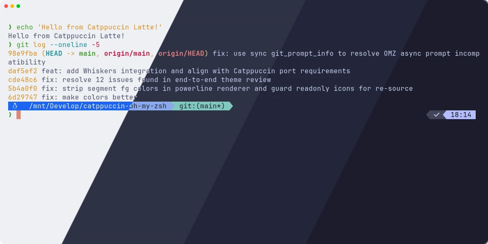
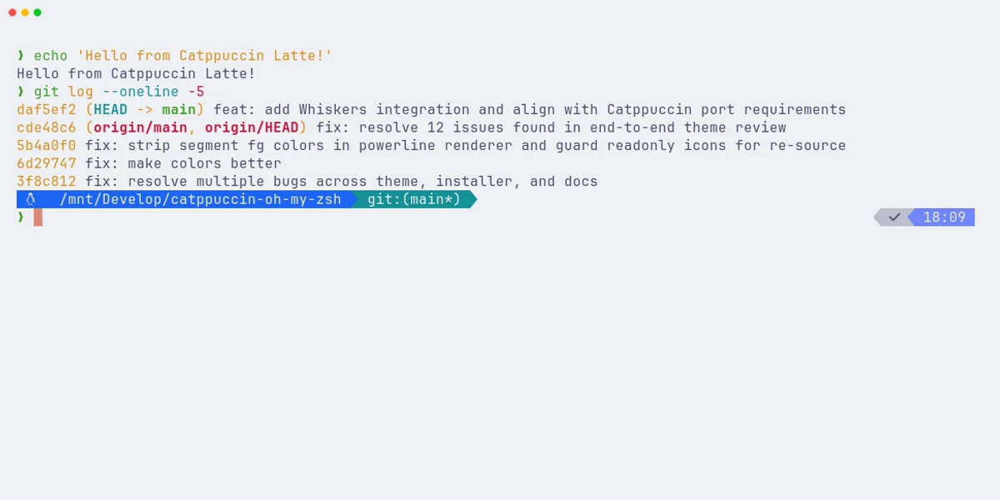
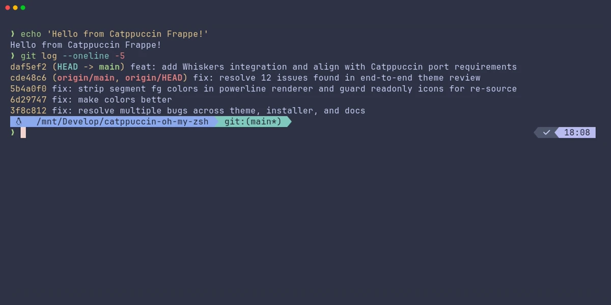
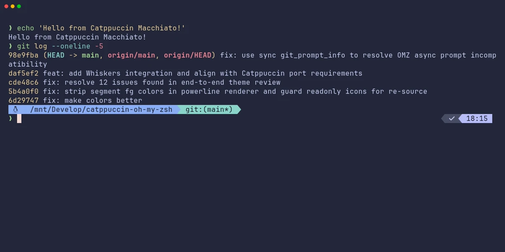
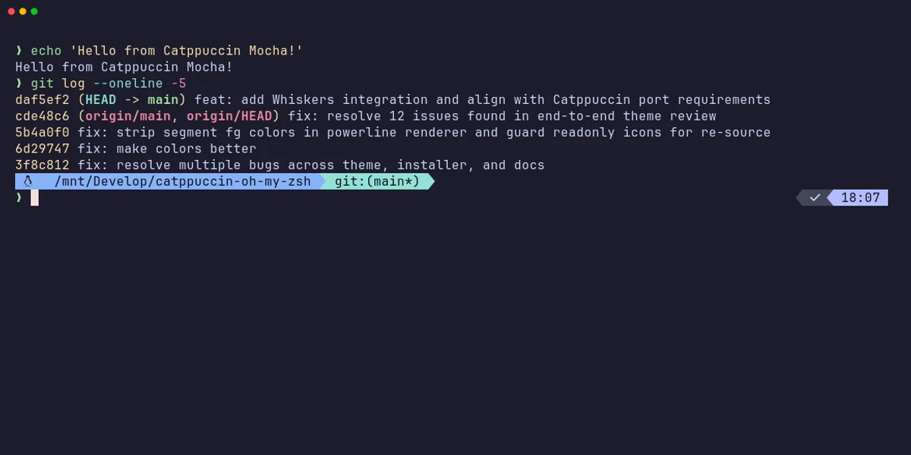

<h3 align="center">
  <br/>
  
  Catppuccin for <a href="https://ohmyz.sh/">Oh My Zsh</a>
  
</h3>

<p align="center">
  <a href="https://github.com/Xerrion/catppuccin-oh-my-zsh/stargazers"></a>
  <a href="https://github.com/Xerrion/catppuccin-oh-my-zsh/issues"></a>
  <a href="https://github.com/Xerrion/catppuccin-oh-my-zsh/contributors"></a>
</p>

<p align="center">
  
</p>

## Previews

<details>
<summary>🌻 Latte</summary>

</details>
<details>
<summary>🪴 Frappe</summary>

</details>
<details>
<summary>🌺 Macchiato</summary>

</details>
<details>
<summary>🌿 Mocha</summary>

</details>

## Installation

### Quick Install (Recommended)

```bash
sh -c "$(curl -fsSL https://raw.githubusercontent.com/Xerrion/catppuccin-oh-my-zsh/main/install.sh)"
```

### Manual Installation

1. Clone the repository:

```bash
git clone https://github.com/Xerrion/catppuccin-oh-my-zsh.git "${ZSH_CUSTOM:-$HOME/.oh-my-zsh/custom}/themes/catppuccin-oh-my-zsh"
```

2. Symlink the theme:

```bash
ln -sf "${ZSH_CUSTOM:-$HOME/.oh-my-zsh/custom}/themes/catppuccin-oh-my-zsh/catppuccin.zsh-theme" "${ZSH_CUSTOM:-$HOME/.oh-my-zsh/custom}/themes/catppuccin.zsh-theme"
```

3. Set the theme in your `~/.zshrc`:

```bash
ZSH_THEME="catppuccin"
```

### Plugin Managers

<details>
<summary>zinit</summary>

```bash
zinit light Xerrion/catppuccin-oh-my-zsh
```
</details>

<details>
<summary>antigen</summary>

```bash
antigen theme Xerrion/catppuccin-oh-my-zsh catppuccin
```
</details>

<details>
<summary>zplug</summary>

```bash
zplug "Xerrion/catppuccin-oh-my-zsh", as:theme
```
</details>

<details>
<summary>sheldon</summary>

Add to `~/.config/sheldon/plugins.toml`:

```toml
[plugins.catppuccin]
github = "Xerrion/catppuccin-oh-my-zsh"
```
</details>

## Configuration

Add these to your `~/.zshrc` **before** `source $ZSH/oh-my-zsh.sh`:

### Flavor

```bash
CATPPUCCIN_FLAVOR="mocha"  # Options: mocha (default), frappe, macchiato, latte
```

### Layout

```bash
CATPPUCCIN_LAYOUT="oneline"  # Options: oneline (default), twoline
```

### Separator

```bash
CATPPUCCIN_SEPARATOR="space"  # Options: space (default), arrow, bar, dot, powerline, or any custom string
```

### Segments

All segments can be individually toggled:

| Variable | Default | Description |
|----------|---------|-------------|
| `CATPPUCCIN_SHOW_ARROW` | `true` | Status indicator (green/red) |
| `CATPPUCCIN_SHOW_USER` | `true` | Username |
| `CATPPUCCIN_SHOW_HOST` | `ssh` | Hostname (`never`/`always`/`ssh`) |
| `CATPPUCCIN_SHOW_CWD` | `true` | Current working directory |
| `CATPPUCCIN_SHOW_GIT` | `true` | Git branch and status |
| `CATPPUCCIN_SHOW_TIME` | `false` | Current time |
| `CATPPUCCIN_SHOW_VENV` | `true` | Python virtualenv |
| `CATPPUCCIN_SHOW_PYTHON` | `false` | Python version |
| `CATPPUCCIN_SHOW_NODE` | `false` | Node.js version |
| `CATPPUCCIN_SHOW_RUST` | `false` | Rust version |
| `CATPPUCCIN_SHOW_GO` | `false` | Go version |
| `CATPPUCCIN_SHOW_RUBY` | `false` | Ruby version |
| `CATPPUCCIN_SHOW_JAVA` | `false` | Java version |
| `CATPPUCCIN_SHOW_PHP` | `false` | PHP version |
| `CATPPUCCIN_SHOW_K8S` | `false` | Kubernetes context |
| `CATPPUCCIN_SHOW_JOBS` | `false` | Background job count |
| `CATPPUCCIN_SHOW_EXEC_TIME` | `false` | Last command execution time |

### Color Overrides

Override any segment color using Catppuccin palette names:

```bash
CATPPUCCIN_COLOR_USER="mauve"      # Default: pink
CATPPUCCIN_COLOR_CWD="sapphire"    # Default: blue
CATPPUCCIN_COLOR_GIT_BRANCH="sky"  # Default: teal
```

Available colors: `rosewater`, `flamingo`, `pink`, `mauve`, `red`, `maroon`, `peach`, `yellow`, `green`, `teal`, `sky`, `sapphire`, `blue`, `lavender`, `text`, `subtext1`, `subtext0`, `overlay2`, `overlay1`, `overlay0`, `surface2`, `surface1`, `surface0`

### Segment Order

Customize the segment display order:

```bash
CATPPUCCIN_SEGMENTS="arrow user host cwd git venv python node rust go ruby java php k8s jobs exec_time time"
```

### Additional Options

```bash
CATPPUCCIN_CWD_TRUNCATE=3          # Directory depth (default: 3)
CATPPUCCIN_TIME_FORMAT="HH:MM"     # Time format (default: "HH:MM", or "HH:MM:SS")
CATPPUCCIN_EXEC_TIME_MIN=2         # Min seconds to show exec time (default: 2)
CATPPUCCIN_GIT_SHOW_STASH=true     # Show stash indicator (default: true)
CATPPUCCIN_GIT_SHOW_AHEAD_BEHIND=true  # Show ahead/behind counts (default: true)
```

## Uninstalling

```bash
sh -c "$(curl -fsSL https://raw.githubusercontent.com/Xerrion/catppuccin-oh-my-zsh/main/install.sh)" -- --uninstall
```

Or manually remove the theme directory and revert your `.zshrc` changes.

## FAQ

### How do I change the prompt symbol?
The arrow segment uses `>` by default. You can disable it (`CATPPUCCIN_SHOW_ARROW=false`) and use `PROMPT` customization in your `.zshrc`.

### Language version segments are slow. What can I do?
Language segments only activate when project files are detected (e.g., `package.json` for Node.js). If you still experience slowness, disable unused language segments.

## Thanks to

- [JannoTjarks](https://github.com/JannoTjarks) - Original theme author
- [Catppuccin](https://github.com/catppuccin) - Soothing pastel color palette

<p align="center">
  
</p>

<p align="center">
  Copyright &copy; 2021-present <a href="https://github.com/catppuccin" target="_blank">Catppuccin Org</a>
</p>

<p align="center">
  <a href="https://github.com/Xerrion/catppuccin-oh-my-zsh/blob/main/LICENSE"></a>
</p>
